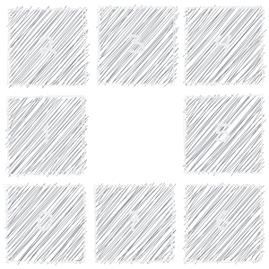

Un programme tout simple, c'est une série de tâches qui part du haut vers le bas et que la machine exécute une par une pour obtenir un résultat.

Voici un exemple de programme qui crée une variable contenant le texte « Bonjour Marvin ! » puis qui l'affiche dans la console :

```ts
let message = "Bonjour Marvin !"
Console.print(message)
```

Mon programme est constitué de deux tâches :

1. Je crée une variable qui s'appelle `message` et qui contient le texte `"Bonjour Marvin !"`.
2. J'affiche le contenu de la variable `message` dans la console.

:::oofmarvin
Attends un peu... C'est quoi, une variable ?
:::

:::profremi
Une variable, c'est comme une boîte dans laquelle on peut enregistrer une donnée. Elle peut porter le nom de ton choix, comme si tu collais une étiquette sur la boite pour te souvenir de ce qu'elle contient.
:::

:::winkastride
Ici, l'étiquette de la boîte est `message` et son contenu est le texte « Bonjour Marvin ! ».
:::


:::profremi
Dans certains cas, on ne peut pas changer la valeur de la variable une fois qu'on l'a définie. On appelle souvent ça une constante.
:::

Une variable peut contenir plusieurs **types de données** : un nombre entier, un texte... Dans certains langages de programmation, une fois que le type de la variable a été défini, il ne peut plus changer : vous pouvez remplacer un nombre entier par un autre nombre entier, mais pas par un texte.

On peut agir sur les variables avec des **opérateurs arithmétiques** comme l'addition, la soustraction et la multiplication.

```ts
let bananasCount = 2
let cherriesCount = 8
let fruitsTotal = bananasCount + cherriesCount
Console.print(fruitsTotal)
```

Ce petit programme va afficher `10` dans la console.

On trouve bien sûr tous les opérateurs que vous connaissez (`+`, `-`, `*`, `/`), mais en programmation, il nous arrive aussi d'utiliser des opérateurs un peu plus originaux ! Un exemple assez courant, c'est le modulo, qui donne le reste d'une division euclidienne. Prenons le calcul suivant :

> 14 ÷ 5 = 2 et il reste 4.

Cela veut dire que 14 modulo 5 = 4 !

:::oofmarvin
Je ne comprends pas trop à quoi ça sert...
:::

:::remi
C'est très utile pour faire des boucles !
:::

Imaginez un mini-plateau de Monopoly avec 8 cases numérotées de 0 à 7. Le joueur est à la case 0 et il va lancer deux dés de 6.



Si le résultat est 5, il doit arriver sur la case 5. Mais si le résultat est 10, il doit faire un tour complet et arriver sur la case 2 !

Pour obtenir la bonne case d'arrivée, on peut utiliser le modulo :

- Si le jet de dés donne 5 → 5 modulo 8 = 5.
- Si le jet de dés donne 10 → 10 modulo 8 = 2.

```ts
let currentPosition = 0
let diceRoll = Math.random(2, 12) // donne un résultat entre 2 et 12
let newPosition = currentPosition + diceRoll % 8
Console.print(newPosition)
```

Ce petit programme affiche donc la case d'arrivée. Comme vous le voyez, la plupart des langages permettent de faire un modulo avec le signe `%`.

Le modulo peut sembler étrange au début, car on ne sait pas trop à quelle occasion on va réellement s'en servir. Mais c'est une bonne chose de savoir qu'il existe, car il est souvent utilisé dans le développement de jeux pour ce genre d'astuces !
